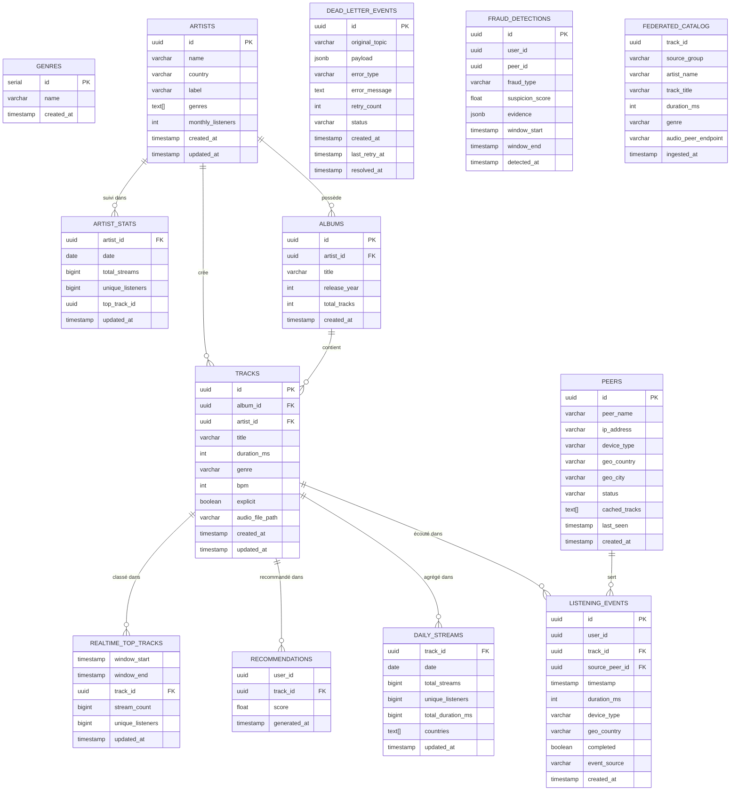

# Modèle de données SPOTIFY

## Diagramme ERD

---

## Questions sur le modèle

### 1. Pourquoi `listening_events` est indexé sur `(timestamp)` ET sur `date_trunc('hour', timestamp)` ?

Ces deux index servent des usages de lecture distincts :

- **`idx_listening_events_timestamp` sur `(timestamp)`** — optimise les requêtes de filtrage par plage de temps (`WHERE timestamp BETWEEN x AND y`). Utilisé par Airflow pour les micro-batches et les analyses sur une période glissante.

- **`idx_listening_events_ts_partition` sur `date_trunc('hour', timestamp)`** — index fonctionnel qui accélère les agrégations horaires (`GROUP BY date_trunc('hour', timestamp)`), comme celles du DAG `aggregation_pipeline`. Sans lui, PostgreSQL effectue un full table scan pour chaque calcul d'agrégat horaire, ce qui devient critique quand la table grossit.

> Un seul index sur `timestamp` brut ne suffit pas pour les agrégations horaires car PostgreSQL ne peut pas utiliser un index sur `timestamp` pour optimiser `date_trunc('hour', timestamp)` — la fonction transforme la valeur, rendant l'index inutilisable sans l'index fonctionnel dédié.

---

### 2. Quelle est la différence entre `daily_streams` (agrégat batch) et `realtime_top_tracks` (Spark) ?

| Critère | `daily_streams` | `realtime_top_tracks` |
|---------|----------------|----------------------|
| **Alimenté par** | DAG Airflow `aggregation_pipeline` | Job Spark `streaming_trends_job` |
| **Fréquence de mise à jour** | Une fois par jour (batch) | Toutes les 5 minutes (streaming) |
| **Latence** | Plusieurs heures | Quelques secondes |
| **Granularité** | Un agrégat complet par jour et par track | Fenêtres temporelles glissantes (window_start / window_end) |
| **Données** | Totaux journaliers complets : streams, unique listeners, durée, pays | Top tracks sur la fenêtre courante uniquement |
| **Usage** | Historique, rapports, base pour les recommandations | Dashboard "en ce moment", charts live |

Les deux tables se complètent : `daily_streams` donne la vue complète et fiable du jour écoulé, `realtime_top_tracks` donne la tendance instantanée. C'est l'architecture Lambda : batch layer + speed layer.

---

### 3. Pourquoi `dead_letter_events.payload` est de type `JSONB` plutôt que `TEXT` ?

`TEXT` stockerait le payload comme une chaîne opaque — impossible à interroger sans sortir les données de la base.

`JSONB` (JSON Binary) apporte quatre avantages concrets pour la DLQ :

1. **Requêtabilité** — on peut filtrer sur des champs internes : `WHERE payload->>'user_id' = '...'` ou `WHERE payload @> '{"event_type": "listening"}'`. Indispensable pour analyser les patterns d'erreur à l'échelle.

2. **Validation à l'insertion** — PostgreSQL rejette tout JSON malformé, garantissant l'intégrité des événements stockés.

3. **Index GIN** — possible d'indexer les champs fréquemment interrogés dans le payload sans index externe.

4. **Performance** — stocké en format binaire parsé, l'accès à un champ spécifique ne nécessite pas de re-parser la chaîne à chaque lecture.

> Pour la DLQ spécifiquement : le `dlq_reprocessing_pipeline` doit lire et corriger les payloads défectueux. Avec `JSONB`, il peut cibler les champs manquants ou invalides directement en SQL, sans charger les données en mémoire Python pour les parser.
